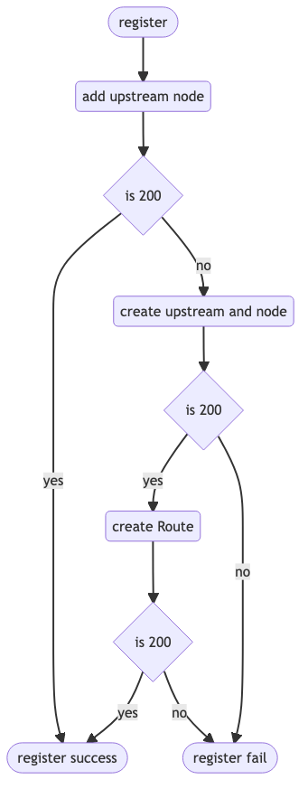

<!-- TOC -->
* [spring-cloud-apisix](#spring-cloud-apisix)
* [安装Apache APISIX](#apache-apisix)
* [引入注册中心和服务发现](#)
* [负载均衡](#)
  * [service to service](#service-to-service)
  * [service to gateway to service](#service-to-gateway-to-service)
* [devtools](#devtools)
<!-- TOC -->


#  spring-cloud-apisix

Spring Cloud APISIX is a Spring Cloud framework based on Apache APISIX

> 目前仅测试过`Apache APISIX 2.14`, 其他版本并未经过测试，建议不要用于生产环境哦！！！
> Spring Cloud APISIX还未发布到maven仓库, 想尝鲜的道友们只能自己本地运行哦

> 注册逻辑:



[//]: # (```mermaid)

[//]: # (flowchart TD)

[//]: # (    register&#40;[register]&#41; --> putnode&#40;add upstream node&#41; --> register200{is 200})

[//]: # (    register200 --yes------> registerSuccess&#40;[register success]&#41;)

[//]: # (    register200 --no--> putUpstream&#40;create upstream and node&#41; --> upstream200{is 200})

[//]: # (    upstream200 --yes--> putRoute&#40;create Route&#41;)

[//]: # (    upstream200 --no----> registerFail&#40;[register fail]&#41;)

[//]: # (    putRoute --> Route200{is 200})

[//]: # (    Route200 --yes--> registerSuccess&#40;[register success]&#41;)

[//]: # (    Route200 --no--> registerFail&#40;[register fail]&#41;)

[//]: # (```)


#  安装Apache APISIX


建议使用 2.14 版本，其他版本可能会存在一些问题

```
git clone -b release/apisix-2.14.1 https://github.com/apache/apisix-docker.git
cd apisix-docker/example
docker-compose -p docker-apisix up -d
```

更多的安装方式查看[APISIX 安装指南](https://apisix.apache.org/docs/apisix/installation-guide/ )


#  引入注册中心和服务发现


将一个服务注册到Apache APISIX, 详细请查看`spring-cloud-apisix-examples/provider-example`工程

> pom.xml
```xml
    <dependencies>
        <dependency>
            <groupId>plus.wcj</groupId>
            <artifactId>spring-cloud-starter-apisix-discovery</artifactId>
        </dependency>
  
        <dependency>
            <groupId>org.springframework.boot</groupId>
            <artifactId>spring-boot-starter-web</artifactId>
        </dependency>
    </dependencies>
```

> application.yml
```yml
spring:
  application:
    name: provider-example
  cloud:
    apisix:
      discovery:
        address: http://nuc8i7.wcj.plus:9080
        control-address: http://nuc8i7.wcj.plus:9092
        active-health-check: true
        passive-health-check: true
        active-health-check-path: /hello
        token: edd1c9f034335f136f87ad84b625c8f1
```

> ProviderExampleApplication.java
```java
@SpringBootApplication
public class ProviderExampleApplication {
  
    public static void main(String[] args) {
        SpringApplication.run(ProviderExampleApplication.class, args);
    }
  
    @RestController
    @RequestMapping("hello")
    public class HelloController {
  
        @GetMapping
        public String hello() {
            return "hello Apache APISIX";
        }
  
    }
  
}
```


#  负载均衡


##  service to service


可以使用 `RestTemplate` `WebClient` `OpenFeign` 进行服务的调用。

> pom.xml
```xml
    <dependencies>
        <dependency>
            <groupId>plus.wcj</groupId>
            <artifactId>spring-cloud-starter-apisix-discovery</artifactId>
        </dependency>
  
        <dependency>
            <groupId>plus.wcj</groupId>
            <artifactId>spring-cloud-starter-apisix-loadbalancer</artifactId>
        </dependency>
  
        <dependency>
            <groupId>org.springframework.boot</groupId>
            <artifactId>spring-boot-starter-web</artifactId>
        </dependency>
  
    </dependencies>
```

> application.yml
```yml
spring:
  application:
    name: consumer-example
  cloud:
    apisix:
      discovery:
        address: http://nuc8i7.wcj.plus:9080
        control-address: http://nuc8i7.wcj.plus:9092
        active-health-check: true
        passive-health-check: true
        active-health-check-path: /hello
        token: edd1c9f034335f136f87ad84b625c8f1
```

> HelloClient.java
```java
@FeignClient(value = "provider-example", name = "provider-example", contextId = "provider-example", path = "hello")
public interface HelloClient {
  
    @GetMapping
    String hello();
  
}
```

> ConsumerExampleApplication.java
```java
@SpringBootApplication
@EnableFeignClients(basePackageClasses = HelloClient.class)
public class ConsumerExampleApplication {
  
    public static void main(String[] args) {
        SpringApplication.run(ConsumerExampleApplication.class, args);
    }
  
    @RestController
    @RequestMapping("hello")
    public class HelloController {
  
        @Autowired
        private HelloClient helloClient;
  
        @GetMapping
        public String hello() {
            return helloClient.hello();
        }
  
    }
  
}
```
##  service to gateway to service


可以使用 `RestTemplate` `WebClient` `OpenFeign` 进行服务的调用。会改变`spring-cloud-loadbalancer`的一些行为。

灵感源于 [APISIX 助力中东社交软件，实现本地化部署](https://apisix.apache.org/zh/blog/2022/06/14/beeto-with-apache-apisix/ )

> pom.xml
```xml
    <dependencies>
        <dependency>
            <groupId>plus.wcj</groupId>
            <artifactId>spring-cloud-starter-apisix-discovery</artifactId>
        </dependency>
  
        <dependency>
            <groupId>plus.wcj</groupId>
            <artifactId>spring-cloud-starter-apisix-loadbalancer</artifactId>
        </dependency>
  
        <dependency>
            <groupId>org.springframework.boot</groupId>
            <artifactId>spring-boot-starter-web</artifactId>
        </dependency>
  
    </dependencies>
```

> application.yml
```yml
spring:
  application:
    name: consumer-gateway-example
  cloud:
    apisix:
      discovery:
        address: http://nuc8i7.wcj.plus:9080
        control-address: http://nuc8i7.wcj.plus:9092
        active-health-check: true
        passive-health-check: true
        active-health-check-path: /hello
        token: edd1c9f034335f136f87ad84b625c8f1
      gateway:
        loadbalancer:
          provider-example:
            scheme: HTTP
            host: nuc8i7.wcj.plus
            port: 9080
    loadbalancer:
      configurations: apisix
server:
  port: 0
  
```

> HelloClient.java
```java
@FeignClient(value = "provider-example", name = "provider-example", contextId = "provider-example", path = "hello")
public interface HelloClient {
  
    @GetMapping
    String hello();
  
}
```

> ConsumerGatewayExampleApplication.java
```java
@SpringBootApplication
@EnableFeignClients(basePackageClasses = HelloClient.class)
public class ConsumerGatewayExampleApplication {
  
    public static void main(String[] args) {
        SpringApplication.run(ConsumerGatewayExampleApplication.class, args);
    }
  
    @RestController
    @RequestMapping("hello")
    public class HelloController {
  
        @Autowired
        private HelloClient helloClient;
  
        @GetMapping
        public String hello() {
            return helloClient.hello();
        }
  
    }
  
}
```
# devtools

[健康检查](https://apisix.apache.org/zh/docs/apisix/tutorials/health-check/#%E6%8F%8F%E8%BF%B0) 相关的issues [issues/7964](https://github.com/apache/apisix/issues/7964)，[issues/7141](https://github.com/apache/apisix/issues/7141)

实际体验的感觉就是Upstream的node节点太少无法触发健康检查，你没有任何请求使用Upstream就无法触发健康检查。

1. `spring-cloud-apisix-devtools`会自动注册在servlet容器（Tomcat、Jetty、Undertow）启动的时随机增加两个端口（1000-65535），然后把这两个端口一起注册到`Apache APISIX`
2. 在注册完成后会主动请求一下健康检查的路由


> pom.xml

```xml
    <dependencies>
        <dependency>
            <groupId>org.springframework.boot</groupId>
            <artifactId>spring-boot-starter-web</artifactId>
        </dependency>

        <dependency>
            <groupId>plus.wcj</groupId>
            <artifactId>spring-cloud-apisix-devtools</artifactId>
        </dependency>

    </dependencies>
```


> application.yml

```yml
spring:
  application:
    name: devtools-example
  cloud:
    apisix:
      discovery:
        address: http://nuc8i7.wcj.plus:9080
        control-address: http://nuc8i7.wcj.plus:9092
        active-health-check: true
        passive-health-check: true
        active-health-check-path: /hello
        token: edd1c9f034335f136f87ad84b625c8f1
      devtools:
        gateway-address: http://nuc8i7.wcj.plus:9080
        ports:
          - 28080
          - 38080
          - 48080
server:
  port: 8080
```

> DevtoolsExampleApplication.java
``` java
@SpringBootApplication
public class DevtoolsExampleApplication {

    public static void main(String[] args) {
        SpringApplication.run(DevtoolsExampleApplication.class, args);
    }

}
```

Spring Boot启动后日志会提示
``` log
// 多端口
o.s.b.w.embedded.tomcat.TomcatWebServer  : Tomcat started on port(s): 8080 (http) 28080 (http) 38080 (http) 48080 (http) with context path ''

// 主动触发
p.w.a.d.h.trigger.AutoHealthTrigger      : Apisix devtools healthcheck
```
